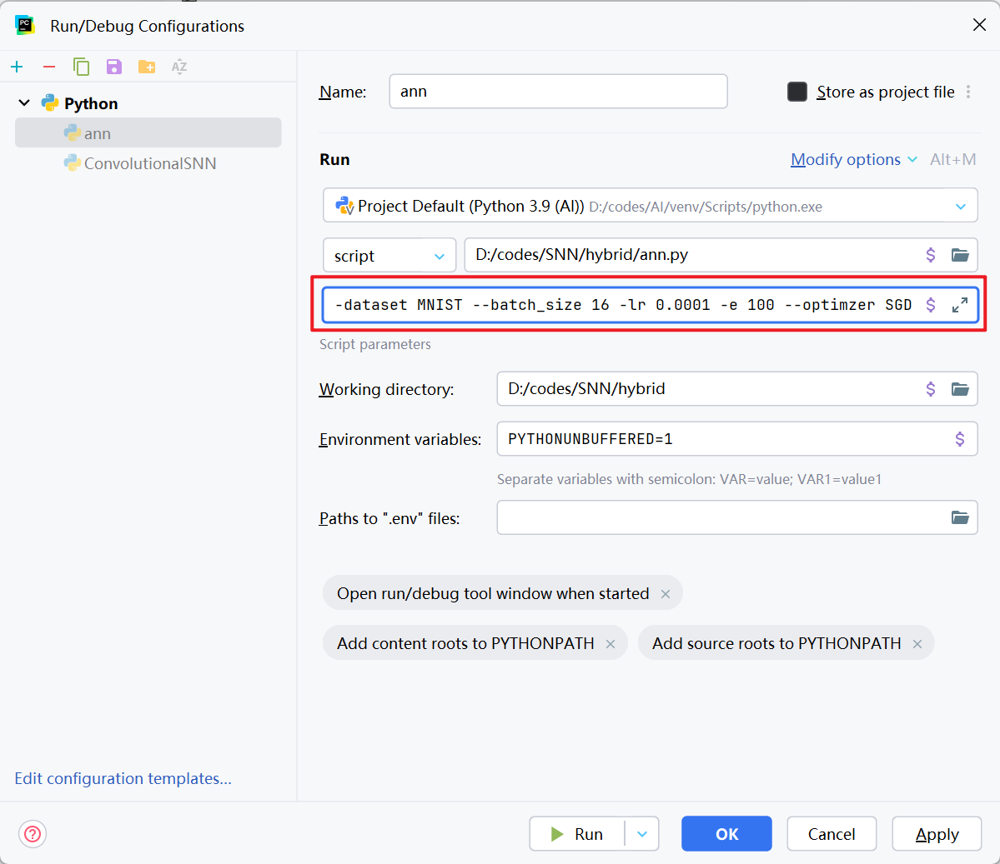

# 基于 STDBP 算法的脉冲神经网络 FPGA 加速实现与优化

## 1. 模型训练

### 1.1 ANN2SNN 方法

#### 1.1.1 ANN 的预训练

>  script: ann2snn 目录下的 `ann.py`

1. 运行方式

   + 终端（进入到 `ann.py` 所在目录）

   ```powershell
   python ann.py --dataset MNIST --batch_size 64 -lr 0.001 -e 100 --optimizer SGD
   ```

   + Pycharm

   

   

   随后点击运行即可

2. 参数说明

|          参数          |          描述          |   默认值    |
| :--------------------: | :--------------------: | :---------: |
|       --dataset        |       数据集名称       |    MNIST    |
|     --dataset_root     |    数据集下载根目录    | E:/DataSets |
|      --batch_size      | 超参数 batch_size 大小 |     64      |
| -lr 或 --learning_rate |      超参数学习率      |    1e-3     |
|     --weight_decay     |  超参数 weight_decay   |    5e-4     |
|    -e 或 --epoches     |     超参数学习轮数     |     100     |
|      --optimizer       |         优化器         |     SGD     |
|         --gpu          |   是否使用 GPU 加速    |    False    |
|         --log          | 是否将输出重定向为日志 |    True     |
|       --log_dir        |      日志保存目录      |   ./logs    |
|      --model_dir       |      模型保存目录      |  ./models   |
|   --pretrained_model   |     预训练模型位置     |    None     |

#### 1.1.2 SNN 的训练

> script: ann2snn 目录下的 `snn.py`

参数说明：

|       参数        |          描述          |   默认值    |
| :---------------: | :--------------------: | :---------: |
|       --ann       | 预训练 ANN 模型的路径N |     N/A     |
|     --dataset     |       数据集名称       |    MNIST    |
|  --dataset_root   |    数据集下载根目录    | E:/DataSets |
|   -m 或 --mode    |        转换模式        |     max     |
| -T 或 -time_steps |      超参数时间步      |     100     |
|       --gpu       |   是否使用 GPU 加速    |    False    |
|       --log       | 是否将输出重定向为日志 |    True     |
|     --log_dir     |      日志保存目录      |   ./logs    |
|    --model_dir    |      模型保存目录      |  ./models   |

### 1.2 SNN from Scratch

> script: snn-from-scratch 目录下的 `snn.py`

参数说明：

|          参数          |          描述          |   默认值    |
| :--------------------: | :--------------------: | :---------: |
|       --dataset        |       数据集名称       |    MNIST    |
|     --dataset_root     |    数据集下载根目录    | E:/DataSets |
|   -T 或 -time_steps    |      超参数时间步      |     100     |
|      -t 或 --tau       |  超参数神经元时间常数  |     2.0     |
|      --batch_size      | 超参数 batch_size 大小 |     64      |
| -lr 或 --learning_rate |      超参数学习率      |    1e-3     |
|     --weight_decay     |  超参数 weight_decay   |    5e-4     |
|    -e 或 --epoches     |     超参数学习轮数     |     100     |
|      --optimizer       |         优化器         |    Adam     |
|         --cupy         |   是否使用 cupy 加速   |    False    |
|         --amp          |  是否使用自动混合精度  |    False    |
|         --log          | 是否将输出重定向为日志 |    True     |
|       --log_dir        |      日志保存目录      |   ./logs    |
|      --model_dir       |      模型保存目录      |  ./models   |
|   --pretrained_model   |     预训练模型位置     |    None     |

### 1.3 BP+STDP Training

> script: BP_STDP 文件夹下的 `BP_STDP.py`

参数说明：

|          参数          |            描述            |   默认值    |
| :--------------------: | :------------------------: | :---------: |
|       --dataset        |         数据集名称         |    MNIST    |
|     --dataset_root     |      数据集下载根目录      | E:/DataSets |
|   -T 或 -time_steps    |        超参数时间步        |     100     |
|       --tau_pre        | 超参数突触前神经元时间常数 |     2.0     |
|       --tau_post       | 超参数突触后神经元时间常数 |    100.0    |
|      --batch_size      |   超参数 batch_size 大小   |     64      |
| -lr 或 --learning_rate |        超参数学习率        |    1e-3     |
|     --weight_decay     |    超参数 weight_decay     |    5e-4     |
|    -e 或 --epoches     |       超参数学习轮数       |     100     |
|         --gpu          |     是否使用 GPU 加速      |    False    |
|         --log          |   是否将输出重定向为日志   |    True     |
|       --log_dir        |        日志保存目录        |   ./logs    |
|      --model_dir       |        模型保存目录        |  ./models   |
|   --pretrained_model   |       预训练模型位置       |    None     |

